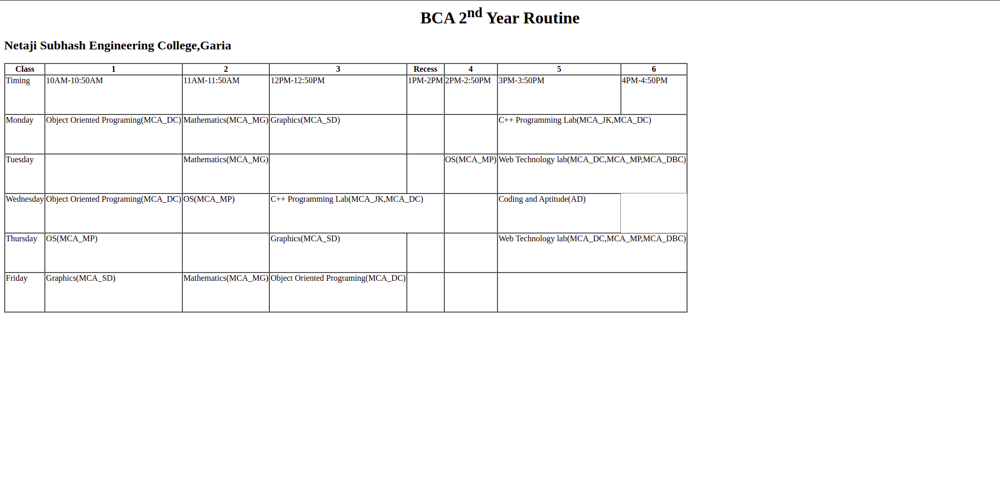
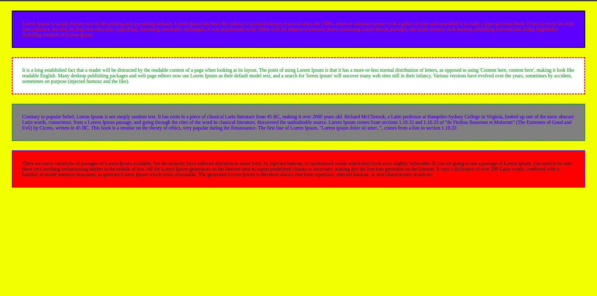

# Tuition_HTML_CSS

## Routine
- Create Routine with Table tag in HTML.

## Schedule
- Create Routine with Table tag in HTML and use style with CSS in every column.

## paragraph
- Different Paragraph with Different CSS 

